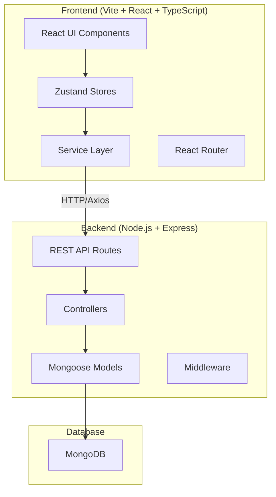

# Personal Command Center — Full-Stack Implementation Plan

A personal productivity dashboard ("What should I focus on today?") with a React/TypeScript frontend and Node.js/Express backend.

## Architecture Overview



---

## User Review Required

> [!IMPORTANT]
> **Tech Stack Confirmation**: The PRD specifies Tailwind CSS. Per your workspace guidelines I'd normally use vanilla CSS, but since the PRD explicitly requests Tailwind, I'll use **Tailwind CSS v3** for this project. Please confirm.

> [!IMPORTANT]
> **Backend Database**: The PRD mentions MongoDB for the future backend. I'll set up the backend with **MongoDB + Mongoose**. You'll need a MongoDB instance (local or Atlas). Please confirm, or let me know if you'd prefer a different database (e.g., SQLite, PostgreSQL).

> [!IMPORTANT]
> **Authentication**: The PRD doesn't include auth in MVP scope, but the backend needs some way to associate data with a user. I'll implement **simple JWT auth** (register/login) so data is user-scoped. The frontend will have a simple login/register flow. Confirm or skip auth?

## Open Questions

> [!NOTE]
> **MongoDB Connection**: Do you have a MongoDB instance ready (local or MongoDB Atlas)? I can set up the backend to use a `.env` config so you can plug in your connection string.

> [!NOTE]
> **Username "Azhar"**: The PRD uses "Good morning, Azhar" — I'll use this as the default display name. You can change it in settings.

---

## Proposed Changes

The project will be a **monorepo** with two directories:

```
Personal Command Center/
├── client/          ← React frontend (Vite)
├── server/          ← Node.js/Express backend
├── package.json     ← Root scripts
└── README.md
```

---

### Phase 1 — Project Scaffolding & Backend

#### [NEW] Root Configuration
- `package.json` — Root package with scripts to run both client and server
- `.gitignore` — Git ignore for node_modules, dist, .env
- `.env.example` — Environment variable template
- `README.md` — Project documentation

#### [NEW] `server/` — Express Backend

```
server/
├── package.json
├── src/
│   ├── index.js              ← Entry point
│   ├── app.js                ← Express app setup
│   ├── config/
│   │   └── db.js             ← MongoDB connection
│   ├── middleware/
│   │   ├── auth.js           ← JWT auth middleware
│   │   ├── errorHandler.js   ← Global error handler
│   │   └── validate.js       ← Request validation
│   ├── models/
│   │   ├── User.js
│   │   ├── Task.js
│   │   ├── Goal.js
│   │   ├── Habit.js
│   │   ├── Note.js
│   │   └── ImportantDate.js
│   ├── routes/
│   │   ├── auth.js
│   │   ├── tasks.js
│   │   ├── goals.js
│   │   ├── habits.js
│   │   ├── notes.js
│   │   └── dates.js
│   ├── controllers/
│   │   ├── authController.js
│   │   ├── taskController.js
│   │   ├── goalController.js
│   │   ├── habitController.js
│   │   ├── noteController.js
│   │   └── dateController.js
│   └── utils/
│       └── helpers.js
└── .env
```

**API Endpoints:**

| Resource | Method | Endpoint | Description |
|----------|--------|----------|-------------|
| Auth | POST | `/api/auth/register` | Register user |
| Auth | POST | `/api/auth/login` | Login user |
| Auth | GET | `/api/auth/me` | Get current user |
| Tasks | GET | `/api/tasks` | Get all tasks |
| Tasks | POST | `/api/tasks` | Create task |
| Tasks | PUT | `/api/tasks/:id` | Update task |
| Tasks | DELETE | `/api/tasks/:id` | Delete task |
| Tasks | PATCH | `/api/tasks/reorder` | Reorder tasks |
| Goals | GET | `/api/goals` | Get all goals |
| Goals | POST | `/api/goals` | Create goal |
| Goals | PUT | `/api/goals/:id` | Update goal |
| Goals | DELETE | `/api/goals/:id` | Delete goal |
| Habits | GET | `/api/habits` | Get all habits |
| Habits | POST | `/api/habits` | Create habit |
| Habits | PUT | `/api/habits/:id` | Update habit |
| Habits | DELETE | `/api/habits/:id` | Delete habit |
| Habits | POST | `/api/habits/:id/toggle` | Toggle habit completion |
| Notes | GET | `/api/notes` | Get all notes |
| Notes | POST | `/api/notes` | Create note |
| Notes | PUT | `/api/notes/:id` | Update note |
| Notes | DELETE | `/api/notes/:id` | Delete note |
| Dates | GET | `/api/dates` | Get all dates |
| Dates | POST | `/api/dates` | Create date |
| Dates | PUT | `/api/dates/:id` | Update date |
| Dates | DELETE | `/api/dates/:id` | Delete date |
| Dashboard | GET | `/api/dashboard` | Get dashboard summary |
| Analytics | GET | `/api/analytics/weekly` | Get weekly analytics |

---

### Phase 2 — Frontend Scaffolding

#### [NEW] `client/` — Vite React App

```
client/
├── package.json
├── vite.config.ts
├── tailwind.config.js
├── tsconfig.json
├── index.html
├── public/
└── src/
    ├── main.tsx
    ├── App.tsx
    ├── index.css              ← Tailwind + custom styles
    ├── types/
    │   └── index.ts           ← All TypeScript interfaces
    ├── lib/
    │   ├── api.ts             ← Axios instance
    │   └── storage.ts         ← localStorage abstraction
    ├── services/
    │   ├── authService.ts
    │   ├── taskService.ts
    │   ├── goalService.ts
    │   ├── habitService.ts
    │   ├── noteService.ts
    │   └── dateService.ts
    ├── stores/
    │   ├── authStore.ts
    │   ├── taskStore.ts
    │   ├── goalStore.ts
    │   ├── habitStore.ts
    │   ├── noteStore.ts
    │   ├── dateStore.ts
    │   └── settingsStore.ts
    ├── hooks/
    │   ├── useKeyboardShortcuts.ts
    │   └── useGreeting.ts
    ├── components/
    │   ├── ui/                ← Reusable UI primitives
    │   │   ├── Button.tsx
    │   │   ├── Input.tsx
    │   │   ├── Modal.tsx
    │   │   ├── Badge.tsx
    │   │   ├── ProgressBar.tsx
    │   │   ├── Skeleton.tsx
    │   │   ├── Toast.tsx
    │   │   └── EmptyState.tsx
    │   ├── layout/
    │   │   ├── AppLayout.tsx
    │   │   ├── Sidebar.tsx
    │   │   ├── TopBar.tsx
    │   │   └── MobileNav.tsx
    │   ├── dashboard/
    │   │   ├── Greeting.tsx
    │   │   ├── TodaySummary.tsx
    │   │   ├── PriorityTasks.tsx
    │   │   ├── UpcomingDates.tsx
    │   │   ├── HabitSummary.tsx
    │   │   ├── GoalProgress.tsx
    │   │   └── DailyProgress.tsx
    │   ├── tasks/
    │   │   ├── TaskList.tsx
    │   │   ├── TaskCard.tsx
    │   │   ├── TaskForm.tsx
    │   │   └── TaskFilters.tsx
    │   ├── goals/
    │   │   ├── GoalCard.tsx
    │   │   ├── GoalForm.tsx
    │   │   └── GoalProgress.tsx
    │   ├── habits/
    │   │   ├── HabitCard.tsx
    │   │   ├── HabitForm.tsx
    │   │   ├── HabitCalendar.tsx
    │   │   └── HabitStreak.tsx
    │   ├── notes/
    │   │   ├── NoteCard.tsx
    │   │   ├── NoteForm.tsx
    │   │   └── NoteList.tsx
    │   ├── dates/
    │   │   ├── DateCard.tsx
    │   │   ├── DateForm.tsx
    │   │   └── DateList.tsx
    │   └── command/
    │       └── CommandPalette.tsx
    ├── pages/
    │   ├── Dashboard.tsx
    │   ├── Tasks.tsx
    │   ├── Goals.tsx
    │   ├── Habits.tsx
    │   ├── Notes.tsx
    │   ├── Dates.tsx
    │   ├── Analytics.tsx
    │   ├── Settings.tsx
    │   ├── Login.tsx
    │   └── Register.tsx
    └── utils/
        ├── dateUtils.ts
        └── analyticsUtils.ts
```

---

### Phase 3 — Core UI Components & Layout

Build the design system and layout shell:
- **AppLayout** with responsive sidebar (desktop) / bottom nav (mobile)
- **Sidebar** with navigation, active states, collapsible on tablet
- **TopBar** with search trigger, theme toggle, user menu
- **Command Palette** (Ctrl+K) for quick actions and global search
- **UI Primitives**: Button, Input, Modal, Badge, ProgressBar, Skeleton, Toast, EmptyState

**Design System (Tailwind):**
- Dark mode as default with light mode option
- Custom color palette (slate-based neutrals, blue/violet accents)
- Smooth transitions and micro-animations
- Glass-morphism effects on cards
- Inter font from Google Fonts

---

### Phase 4 — Task Management

- Full CRUD with backend API integration
- Priority badges (Low/Medium/High) with color coding
- Status management (Todo → In Progress → Completed)
- Due date with urgency indicators
- Drag & drop reordering with `@dnd-kit/core`
- Filtering by status, priority, category
- Sorting by date, priority, name
- Inline completion toggle

---

### Phase 5 — Goals

- Goal CRUD with progress tracking
- Visual progress bars with percentage
- Target date tracking
- Status transitions
- Dashboard goal cards showing active goals

---

### Phase 6 — Habits

- Habit CRUD with daily/weekly frequency
- One-click completion toggle
- Streak calculation (current + longest)
- Weekly calendar heatmap visualization
- Completion rate calculation
- Dashboard habit summary

---

### Phase 7 — Important Dates

- Date CRUD with type classification
- Urgency indicators (🔴 today, 🟠 tomorrow, 🟡 3 days, 🟢 7+ days)
- Sorted by proximity
- Dashboard upcoming dates widget

---

### Phase 8 — Notes

- Note CRUD with tag support
- Search within notes
- Tag filtering
- Quick note creation from command palette
- Markdown-lite content (plain text + basic formatting)

---

### Phase 9 — Dashboard

The centerpiece page combining:
- **Greeting** — Time-based with user name
- **Today's Summary** — Task/habit/deadline counts with click navigation
- **Daily Priorities** — Top 3 items (enforced limit)
- **Priority Tasks** — Today's high-priority tasks
- **Daily Progress** — Combined progress bar (tasks + habits + priorities)
- **Upcoming Dates** — Next deadlines with urgency
- **Habit Summary** — Today's habits with completion
- **Goal Progress** — Active goals with progress bars

---

### Phase 10 — Analytics

- Weekly task completion chart (bar chart via Recharts)
- Habit completion rate chart
- Goal progress visualization
- Daily productivity score calculation
- Weekly summary stats (tasks completed, habits completed, goal progress %)
- Productivity trend line

---

### Phase 11 — Polish & Production

- Dark/Light/System theme with persistence
- Framer Motion animations (page transitions, card animations, list reordering)
- Empty states with illustrations and CTAs
- Loading skeletons for all data views
- Error states with retry actions
- Toast notifications for CRUD operations
- Full responsive design (desktop/tablet/mobile)
- Keyboard shortcuts throughout
- Accessibility (ARIA, focus management, semantic HTML)
- Production build optimization

---

## Tech Stack Summary

### Frontend
| Technology | Purpose |
|-----------|---------|
| React 18 | UI framework |
| TypeScript | Type safety |
| Vite | Build tool |
| React Router v6 | Client-side routing |
| Zustand | State management |
| Tailwind CSS v3 | Styling |
| Recharts | Charts/analytics |
| @dnd-kit | Drag & drop |
| date-fns | Date utilities |
| Lucide React | Icons |
| Axios | HTTP client |
| React Hook Form + Zod | Form handling + validation |
| Framer Motion | Animations |

### Backend
| Technology | Purpose |
|-----------|---------|
| Node.js | Runtime |
| Express | Web framework |
| MongoDB + Mongoose | Database + ODM |
| JWT (jsonwebtoken) | Authentication |
| bcryptjs | Password hashing |
| cors | CORS handling |
| express-validator | Request validation |
| dotenv | Environment config |
| nodemon | Dev auto-reload |

---

## Verification Plan

### Automated Tests
```bash
# Backend — API endpoint tests (if time permits)
cd server && npm test

# Frontend — Component and store tests
cd client && npm test
```

### Manual Verification
- All CRUD operations for Tasks, Goals, Habits, Notes, Dates
- Dashboard renders correct summary data
- Analytics charts display accurate weekly data
- Drag & drop task reordering persists
- Command palette (Ctrl+K) opens and searches across all entities
- Theme switching persists across refresh
- Responsive layout on desktop, tablet, mobile viewports
- Keyboard navigation throughout the app
- Empty states display correctly
- Error handling for failed API calls
- JWT auth flow (register → login → protected routes)

---

## Execution Strategy

Given the scale of this project, I'll build it in this order:

1. **Backend first** — All models, routes, controllers (server is foundational)
2. **Frontend scaffolding** — Vite setup, Tailwind, routing, layout shell
3. **Service layer + stores** — Connect frontend to backend API
4. **Feature pages** — Tasks → Goals → Habits → Dates → Notes (one by one)
5. **Dashboard** — Aggregate all features
6. **Analytics** — Charts and calculations
7. **Quick actions** — Command palette, keyboard shortcuts
8. **Polish** — Theme, animations, empty states, loading states, responsive

This ensures each layer is stable before building on top of it.
